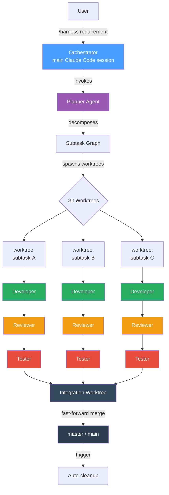
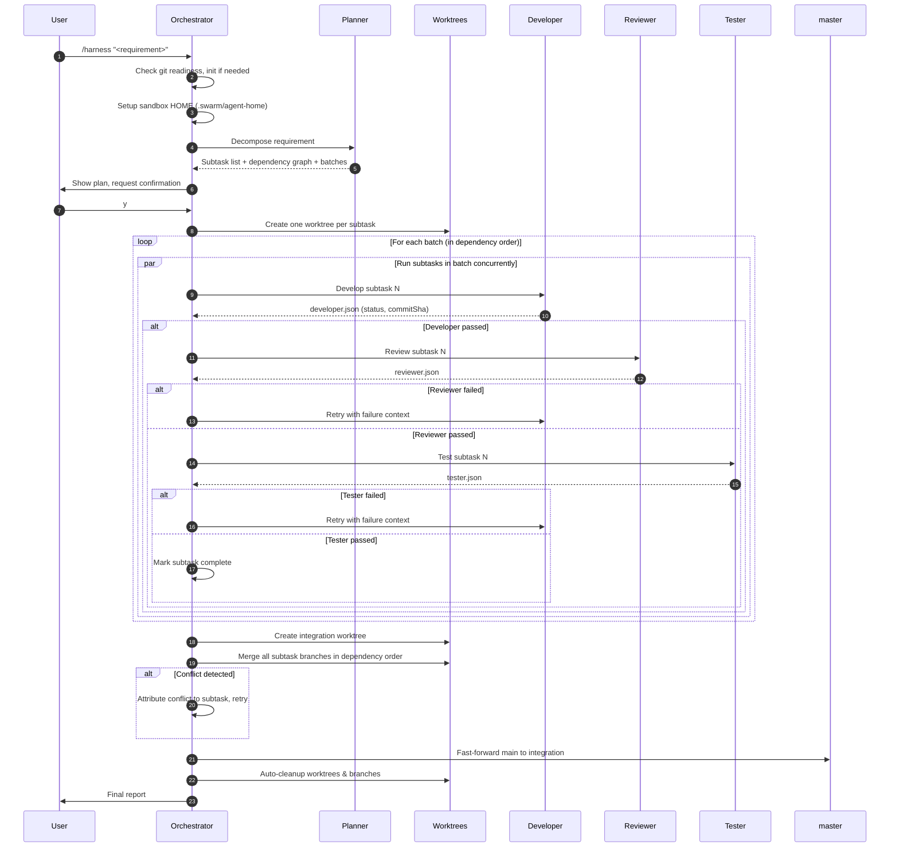
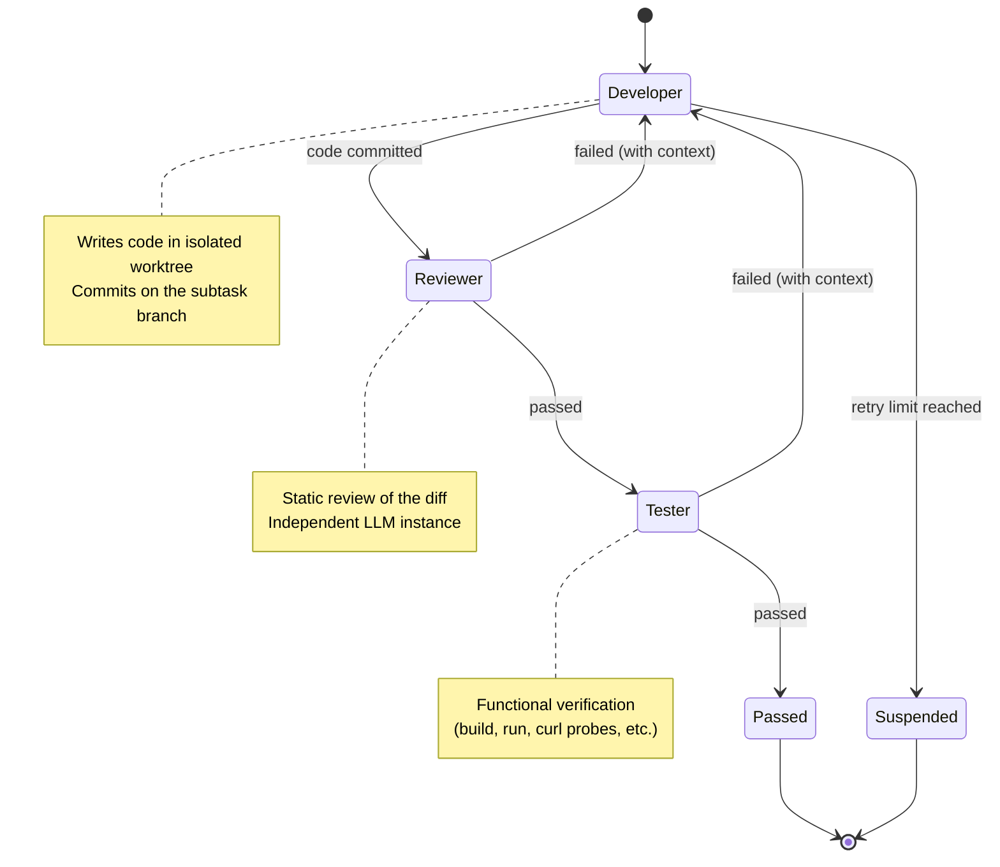

# Harness

> **Multi-Agent Orchestration for Claude Code**
> Decompose complex tasks into parallel subtasks, run Developer / Reviewer / Tester agents in isolated Git worktrees, retry on failure, integrate, and deliver — fully automated.

[简体中文](./README.zh-CN.md) · **English**

---

## Table of Contents

- [Why Harness](#why-harness)
- [Key Features](#key-features)
- [Architecture](#architecture)
- [How It Works](#how-it-works)
- [Quick Start](#quick-start)
- [Configuration](#configuration)
- [The Three Roles](#the-three-roles)
- [Real-World Example](#real-world-example)
- [Commands](#commands)
- [Disk Usage & Cleanup](#disk-usage--cleanup)
- [Multi-LLM Setup](#multi-llm-setup)
- [Troubleshooting](#troubleshooting)
- [FAQ](#faq)
- [Contributing](#contributing)
- [License](#license)

---

## Why Harness

Single-agent coding workflows have three persistent failure modes:

1. **Self-review blind spots** — An LLM that writes code is statistically likely to also miss the same bugs when asked to review it. Different model instances catch different issues.
2. **Context window pressure** — Large multi-file features bury the agent in details and produce inconsistent code across files.
3. **No isolation** — Iterating on one feature can break another; you can't safely parallelize work.

Harness addresses all three by orchestrating **multiple specialized agent roles** in **isolated Git worktrees**, with **dependency-aware concurrency** and **automatic retry loops** driven by **inter-role feedback**.

It runs entirely on your machine, talks to whatever LLM API you configure (Claude, DeepSeek, local Ollama, etc.), and produces a clean fast-forward merge to your main branch when done.

---

## Key Features

| Feature | What it does |
|---|---|
| **Automatic decomposition** | A Planner agent splits your requirement into subtasks and infers their dependency graph |
| **Dependency-aware concurrency** | Subtasks with no inter-dependencies run in parallel; downstream batches wait for upstream completion |
| **Three-role verification** | Every subtask flows through Developer → Reviewer → Tester, each as a separate LLM invocation |
| **Retry with context** | When Reviewer or Tester fails, the failure reason is fed back to a fresh Developer invocation (max 3 retries) |
| **Git worktree isolation** | Each subtask gets its own working directory and branch — no cross-contamination |
| **Conflict attribution** | Merge conflicts are analyzed by an integrator agent and routed back to the responsible subtask |
| **Multi-LLM support** | Different roles can use different models (e.g., DeepSeek for Developer, Claude for Reviewer) |
| **Auto-cleanup** | Worktrees and branches are removed after successful delivery, preserving only KB-scale audit logs |

---

## Architecture



The orchestrator never writes business code. It plans, dispatches, monitors completion, and integrates results.

---

## How It Works

### End-to-End Flow



### Subtask Lifecycle

Each subtask follows a strict three-role state machine. Failure routes back to the Developer with the failure context, so the next attempt sees what went wrong.



### Dependency Batching

Given the dependency graph, the orchestrator groups subtasks into batches. Within each batch, subtasks run concurrently up to `maxConcurrency`.

```
Requirement: Build a Todo App

Subtasks discovered:
  - backend           (no deps)
  - frontend-skeleton (no deps)
  - frontend-app      (depends on frontend-skeleton)
  - readme            (depends on backend + frontend-app)

Batches computed:
  Batch 0  ─►  [ backend, frontend-skeleton ]    ◄── runs in parallel
  Batch 1  ─►  [ frontend-app ]                  ◄── waits for Batch 0
  Batch 2  ─►  [ readme ]                        ◄── waits for Batch 1
```

---

## Quick Start

### Prerequisites

- **Claude Code** installed (`claude` CLI on PATH)
- **Node.js** 16+ (for the install script)
- **Git** 2.20+ (worktree support)

### Installation

**Option 1 — npm registry** (recommended once published):

```bash
npx harness-skill-installer
```

**Option 2 — directly from GitHub**:

```bash
npx github:YOUR_USERNAME/harness-skill
```

**Option 3 — manual**:

```bash
git clone https://github.com/YOUR_USERNAME/harness-skill.git
mkdir -p ~/.claude/skills/harness
cp harness-skill/SKILL.md ~/.claude/skills/harness/
```

### First Run

1. Open a terminal in the project where you want to use Harness.
2. (Optional) Create `.swarm/config.yaml` to configure your LLM — see [Configuration](#configuration).
3. Launch Claude Code in that directory.
4. Type:

```
/harness "Implement a simple Todo app with Vue 3 + Vite frontend, Express backend, supporting CRUD, status filter, and statistics"
```

5. Review the plan that appears, type `y` to confirm.
6. Wait. Subtasks run in parallel. You'll see live progress logs.
7. When done, your code is on `master`, ready to use.

---

## Configuration

Create `.swarm/config.yaml` in your project root:

```yaml
harness:
  # Maximum number of subtasks running concurrently
  maxConcurrency: 3

  # How many times a failed subtask is retried before being suspended
  retryLimit: 3

  # Per-agent timeout in milliseconds (10 minutes)
  timeoutMs: 600000

  agents:
    # Default config — applied to all roles unless overridden
    default:
      provider: anthropic
      baseUrl: https://api.deepseek.com/anthropic
      apiKey: sk-your-deepseek-key
      model: deepseek-v4-flash

    # Optional: override per role
    # reviewer:
    #   provider: anthropic
    #   baseUrl: https://api.anthropic.com
    #   apiKey: sk-ant-your-key
    #   model: claude-sonnet-4-6

  delivery:
    # auto_merge: fast-forward main to the integration branch on success
    strategy: auto_merge
    # Remove worktrees & branches automatically after successful delivery
    autoCleanupOnDelivery: true
```

**No config?** Harness inherits the active Claude Code session's LLM. This is the simplest path if you're already using Claude.

---

## The Three Roles

Each role is a separate sub-agent invocation with a focused prompt. Critically, **each role can run on a different LLM**, which is what makes the cross-checking valuable.

### Developer

- **Goal**: Implement the subtask in its dedicated worktree.
- **Outputs**: A git commit on the subtask branch + a structured JSON result file.
- **Tools**: Bash, Read, Write, Edit, Glob, Grep.

### Reviewer

- **Goal**: Read-only static review of the Developer's diff.
- **Checks**: Code correctness, file paths, contract adherence, security smells.
- **Output**: Pass / fail verdict with itemized issues.

### Tester

- **Goal**: Functional verification — actually run the code.
- **For backends**: Start the server, hit it with curl, verify response shapes and status codes.
- **For frontends**: Run the build, start dev server, verify HTTP responses.
- **For docs**: Cross-check documented commands against actual code.
- **Output**: Pass / fail verdict with evidence (HTTP codes, build exit codes, etc.).

### Why three roles, not one

If you ask the same LLM to "write and test this code," it will rationalize bugs in its own output. Independent invocations — especially across different models — catch the inconsistencies. In our reference Todo App run, the Developer wrote functionally perfect Express code but placed it in the wrong directory; an independent Reviewer instance caught the path error within seconds.

---

## Real-World Example

A complete run of building a Todo App from a single one-line requirement:

```
/harness "Implement a Todo app: Vue 3 + Vite frontend, Express + CORS backend,
         supporting CRUD on /api/todos, status filter, statistics bar"
```

**Resulting plan** (auto-generated):

```
Subtasks: 4
Batches:
  Batch 0  ─►  [backend, frontend-skeleton]   (parallel, both no deps)
  Batch 1  ─►  [frontend-app]                 (deps: frontend-skeleton)
  Batch 2  ─►  [readme]                       (deps: backend + frontend-app)
```

**Execution highlights**:

| Subtask | Final SHA | Attempts | Notable Event |
|---|---|---|---|
| backend | `8ff27eb` | 2 | Attempt 1 placed files at repo root → Reviewer flagged path error → Attempt 2 used `git mv` to relocate |
| frontend-skeleton | `db89832` | 1 | Tester started Vite dev server, verified `/api` proxy routing |
| frontend-app | `844cba3` | 1 | 258-line `App.vue` with CRUD, filter, stats; E2E tested through proxy |
| readme | `35bba56` | 1 | Tester cross-checked all documented commands against actual code |

**Final state**:

- `master` advanced from `bc1ae1b` → `bb9efad` via fast-forward merge
- 0 integration conflicts (dependency order preserved correctness)
- 11 commits in the branch graph (4 features + 4 merges + 3 baseline)
- Total wall time: ~10 minutes (DeepSeek `deepseek-v4-flash`)
- Worktrees: auto-cleaned after delivery, freeing ~120MB

---

## Commands

| Command | Purpose |
|---|---|
| `/harness "<requirement>"` | Start a new orchestration task |
| `/harness status` | Show progress of the current/last task |
| `/harness cleanup <taskId>` | Remove worktrees & branches for a specific task |
| `/harness cleanup --completed` | Clean up all tasks with status `passed` |

---

## Disk Usage & Cleanup

Harness creates one Git worktree per subtask plus an integration worktree. Each worktree may install its own `node_modules`, which adds up fast.

### Built-in mitigation

1. **After Tester completes** — `node_modules` and `dist/` are removed from each subtask worktree (lockfiles stay).
2. **After successful delivery** — All worktrees and branches are deleted automatically. Only `.swarm/state/` (KB-scale JSON logs) remains for `/harness status` and audit purposes.

### Disabling auto-cleanup

If you want to inspect the worktrees post-delivery:

```yaml
harness:
  delivery:
    autoCleanupOnDelivery: false
```

Then run `/harness cleanup <taskId>` manually when finished.

### Manual cleanup

```bash
git worktree list
git worktree remove .swarm/worktrees/<taskId>/<subtaskId> --force
git branch -D swarm/<taskId>/<subtaskId>
```

---

## Multi-LLM Setup

Harness can route different roles to different LLMs. This is the system's superpower: a Developer optimized for cost (DeepSeek) reviewed by a model optimized for accuracy (Claude Sonnet).

### DeepSeek (cost-optimized, recommended for all roles)

```yaml
agents:
  default:
    provider: anthropic
    baseUrl: https://api.deepseek.com/anthropic
    apiKey: sk-your-key
    model: deepseek-v4-flash
```

### Claude (Anthropic official)

```yaml
agents:
  default:
    provider: anthropic
    baseUrl: https://api.anthropic.com
    apiKey: sk-ant-your-key
    model: claude-opus-4-7
```

### Mixed (Developer on DeepSeek, Reviewer on Claude)

```yaml
agents:
  default:
    provider: anthropic
    baseUrl: https://api.deepseek.com/anthropic
    apiKey: sk-deepseek-key
    model: deepseek-v4-flash

  reviewer:
    provider: anthropic
    baseUrl: https://api.anthropic.com
    apiKey: sk-ant-key
    model: claude-sonnet-4-6
```

### Local Ollama (with Anthropic-compatible proxy)

```yaml
agents:
  default:
    provider: anthropic
    baseUrl: http://localhost:11434/v1
    apiKey: ollama
    model: qwen2.5-coder:32b
```

### How sub-agent isolation works (technical detail)

Naively passing `ANTHROPIC_BASE_URL` to a sub-agent silently fails because the Claude CLI re-applies env vars from `~/.claude/settings.json` and credentials from `~/.claude/.credentials.json`. Harness uses a **three-piece isolation suite**:

1. **Unset inherited env** before the dispatch.
2. **`--bare` flag** to disable hooks, plugin sync, OAuth, and keychain.
3. **`--settings <empty.json>` + `HOME`/`USERPROFILE` redirect** to a sandbox dir, so the CLI cannot fall back to user config.

Without all three, sub-agents silently use the parent session's LLM regardless of what you set.

---

## Troubleshooting

### Sub-agents are using the wrong LLM

Set `baseUrl` to a deliberately invalid URL and run a small task:

```yaml
baseUrl: https://this-host-does-not-exist-xyz123.invalid
```

If you get a network error → isolation works correctly.
If you get a normal LLM reply → isolation is broken; the sub-agent fell back to the parent session.

> Self-reports like "I am Claude" or "I am DeepSeek" are unreliable for verifying routing. Network-level errors are the only ground truth.

### Worktrees consuming too much disk

```bash
du -sh .swarm/worktrees/
```

If unexpected size, run `/harness cleanup <taskId>` or check whether `autoCleanupOnDelivery` was disabled.

### Reviewer/Tester didn't write the JSON verdict file

Some LLMs occasionally print the JSON in chat instead of writing to disk. Harness will detect a missing file as failure. If you see this happen repeatedly with a particular model, switch that role to a more reliable model in `.swarm/config.yaml`.

### Task suspended after retry limit

Look at the failed role's output:

```bash
cat .swarm/state/subtasks/<subtaskId>/<role>.stdout.log
```

The Reviewer's `issues` array tells you exactly what kept failing.

---

## FAQ

**Q: How is this different from just asking Claude to "write a Todo app"?**
A: Harness gives you isolation (worktrees), independent verification (separate LLM invocations for review), and concurrent execution (parallel subtasks). For trivial tasks the overhead isn't worth it; for non-trivial multi-file features it consistently produces more reliable results.

**Q: What happens if I interrupt mid-run?**
A: State is persisted to `.swarm/state/` after every role transition. Re-running `/harness` resumes from the last checkpoint.

**Q: Can I see what each agent did?**
A: Yes. Every role's prompt and output is logged to `.swarm/state/subtasks/<subtaskId>/`. You can diff the actual code via `git log swarm/<taskId>/<subtaskId>`.

**Q: Does this work outside Claude Code?**
A: The skill system is Claude Code-specific, but the architecture (Planner → Worktrees → Dev/Rev/Test → Integrate) is portable. The `dispatch.sh` script can be adapted to any CLI agent that supports `-p "prompt"` mode.

**Q: How much does a typical task cost?**
A: Depends on the LLM. A 4-subtask Todo app on DeepSeek `deepseek-v4-flash` costs roughly $0.05–0.20 per run. The same task on Claude Opus 4.7 would be ~10x more.

---

## Contributing

Issues and PRs welcome. Areas that need attention:

- More language ecosystems (currently optimized for Node.js projects)
- Better integration conflict attribution heuristics
- Plugin system for custom Tester strategies (e.g., Playwright, pytest)
- Cross-platform shell support (currently best on Git Bash / macOS / Linux)

When opening a PR, please include a small reproduction case in `.swarm/test-cases/` if your change affects the orchestration loop.

---

## License

MIT — see [LICENSE](./LICENSE).

---

## Acknowledgments

Built as a personal experiment in agent-of-agents architectures, refined through hands-on use during 2026. Inspired by the actor model, Erlang's "let it crash" philosophy, and the empirical observation that two cheap LLMs cross-checking each other often outperform one expensive LLM working alone.
