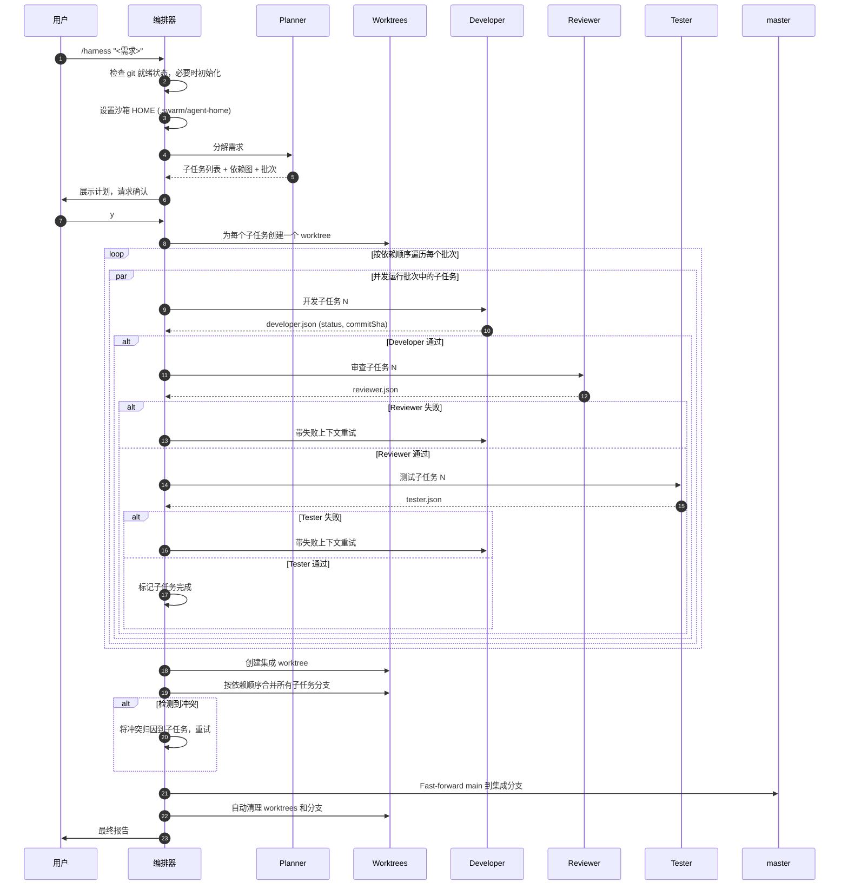
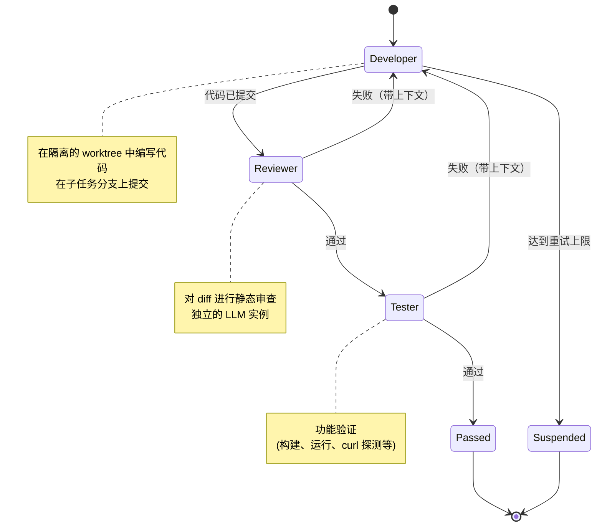

# Harness

> **Claude Code 的多智能体编排系统**
> 将复杂任务分解为并行子任务，在隔离的 Git worktree 中运行 Developer / Reviewer / Tester 智能体，失败自动重试，集成并交付 — 全自动化。

**简体中文** · [English](./README.md)

---

## 目录

- [为什么需要 Harness](#为什么需要-harness)
- [核心特性](#核心特性)
- [架构](#架构)
- [工作原理](#工作原理)
- [快速开始](#快速开始)
- [配置](#配置)
- [三个角色](#三个角色)
- [真实案例](#真实案例)
- [命令](#命令)
- [磁盘占用与清理](#磁盘占用与清理)
- [多 LLM 配置](#多-llm-配置)
- [故障排查](#故障排查)
- [常见问题](#常见问题)
- [贡献](#贡献)
- [许可证](#许可证)

---

## 为什么需要 Harness

单智能体编码工作流存在三个持续性的失败模式:

1. **自我审查盲区** — 编写代码的 LLM 在被要求审查同一段代码时，统计上很可能也会遗漏相同的 bug。不同的模型实例会发现不同的问题。
2. **上下文窗口压力** — 大型多文件功能会让智能体淹没在细节中，导致跨文件代码不一致。
3. **缺乏隔离** — 迭代一个功能可能破坏另一个功能；无法安全地并行化工作。

Harness 通过在**隔离的 Git worktree** 中编排**多个专业化智能体角色**，配合**依赖感知的并发执行**和由**角色间反馈**驱动的**自动重试循环**，解决了以上三个问题。

它完全在你的本地机器上运行，与你配置的任何 LLM API（Claude、DeepSeek、本地 Ollama 等）通信，完成后产生一个干净的 fast-forward 合并到你的主分支。

---

## 核心特性

| 特性 | 功能说明 |
|---|---|
| **自动分解** | Planner 智能体将你的需求拆分为子任务并推断依赖关系图 |
| **依赖感知并发** | 无相互依赖的子任务并行运行；下游批次等待上游完成 |
| **三角色验证** | 每个子任务流经 Developer → Reviewer → Tester，每个都是独立的 LLM 调用 |
| **带上下文重试** | 当 Reviewer 或 Tester 失败时，失败原因会反馈给新的 Developer 调用（最多 3 次重试）|
| **Git worktree 隔离** | 每个子任务获得自己的工作目录和分支 — 无交叉污染 |
| **冲突归因** | 合并冲突由集成器智能体分析并路由回负责的子任务 |
| **多 LLM 支持** | 不同角色可以使用不同模型（例如 Developer 用 DeepSeek，Reviewer 用 Claude）|
| **自动清理** | 成功交付后自动删除 worktree 和分支，仅保留 KB 级审计日志 |

---

## 架构

```mermaid
graph TB
    U[用户] -->|/harness "&lt;需求&gt;"| O[编排器<br/>主 Claude Code 会话]

    O -->|调用| P[Planner 智能体]
    P -->|分解| ST[子任务图]
    ST -->|生成 worktrees| W{Git Worktrees}

    W --> WT1[worktree:<br/>subtask-A]
    W --> WT2[worktree:<br/>subtask-B]
    W --> WT3[worktree:<br/>subtask-C]

    WT1 --> D1[Developer]
    D1 --> R1[Reviewer]
    R1 --> T1[Tester]

    WT2 --> D2[Developer]
    D2 --> R2[Reviewer]
    R2 --> T2[Tester]

    WT3 --> D3[Developer]
    D3 --> R3[Reviewer]
    R3 --> T3[Tester]

    T1 --> I[集成 Worktree]
    T2 --> I
    T3 --> I

    I -->|fast-forward 合并| M[master / main]
    M -->|触发| C[自动清理]

    style O fill:#4a9eff,color:#fff
    style P fill:#9b59b6,color:#fff
    style D1 fill:#27ae60,color:#fff
    style D2 fill:#27ae60,color:#fff
    style D3 fill:#27ae60,color:#fff
    style R1 fill:#f39c12,color:#fff
    style R2 fill:#f39c12,color:#fff
    style R3 fill:#f39c12,color:#fff
    style T1 fill:#e74c3c,color:#fff
    style T2 fill:#e74c3c,color:#fff
    style T3 fill:#e74c3c,color:#fff
    style I fill:#34495e,color:#fff
    style M fill:#2c3e50,color:#fff
```

编排器从不编写业务代码。它负责规划、调度、监控完成和集成结果。

---

## 工作原理

### 端到端流程



### 子任务生命周期

每个子任务遵循严格的三角色状态机。失败会路由回 Developer 并附带失败上下文，因此下次尝试能看到出了什么问题。



### 依赖批次

根据依赖关系图，编排器将子任务分组为批次。在每个批次内，子任务并发运行，最多达到 `maxConcurrency`。

```
需求: 构建一个 Todo 应用

发现的子任务:
  - backend           (无依赖)
  - frontend-skeleton (无依赖)
  - frontend-app      (依赖 frontend-skeleton)
  - readme            (依赖 backend + frontend-app)

计算的批次:
  Batch 0  ─►  [ backend, frontend-skeleton ]    ◄── 并行运行
  Batch 1  ─►  [ frontend-app ]                  ◄── 等待 Batch 0
  Batch 2  ─►  [ readme ]                        ◄── 等待 Batch 1
```

---

## 快速开始

### 前置要求

- **Claude Code** 已安装（`claude` CLI 在 PATH 中）
- **Node.js** 16+（用于安装脚本）
- **Git** 2.20+（worktree 支持）

### 安装

**选项 1 — npm 仓库**（发布后推荐）:

```bash
npx harness-skill-installer
```

**选项 2 — 直接从 GitHub**:

```bash
npx github:YOUR_USERNAME/harness-skill
```

**选项 3 — 手动**:

```bash
git clone https://github.com/YOUR_USERNAME/harness-skill.git
mkdir -p ~/.claude/skills/harness
cp harness-skill/SKILL.md ~/.claude/skills/harness/
```

### 首次运行

1. 在你想使用 Harness 的项目中打开终端。
2. （可选）创建 `.swarm/config.yaml` 配置你的 LLM — 参见[配置](#配置)。
3. 在该目录启动 Claude Code。
4. 输入:

```
/harness "实现一个简单的 Todo 应用，Vue 3 + Vite 前端，Express 后端，支持 CRUD、状态筛选和统计"
```

5. 查看出现的计划，输入 `y` 确认。
6. 等待。子任务并行运行。你会看到实时进度日志。
7. 完成后，你的代码在 `master` 上，可以直接使用。

---

## 配置

在项目根目录创建 `.swarm/config.yaml`:

```yaml
harness:
  # 最多并发执行的子任务数
  maxConcurrency: 3

  # 失败子任务被挂起前的重试次数
  retryLimit: 3

  # 单个智能体超时时间（毫秒，10 分钟）
  timeoutMs: 600000

  agents:
    # 默认配置 — 应用于所有角色，除非被覆盖
    default:
      provider: anthropic
      baseUrl: https://api.deepseek.com/anthropic
      apiKey: sk-your-deepseek-key
      model: deepseek-v4-flash

    # 可选: 按角色覆盖
    # reviewer:
    #   provider: anthropic
    #   baseUrl: https://api.anthropic.com
    #   apiKey: sk-ant-your-key
    #   model: claude-sonnet-4-6

  delivery:
    # auto_merge: 成功时 fast-forward main 到集成分支
    strategy: auto_merge
    # 成功交付后自动删除 worktrees 和分支
    autoCleanupOnDelivery: true
```

**没有配置？** Harness 继承当前 Claude Code 会话的 LLM。如果你已经在使用 Claude，这是最简单的方式。

---

## 三个角色

每个角色都是一个独立的子智能体调用，带有专注的提示词。关键是，**每个角色可以运行在不同的 LLM 上**，这正是交叉检查有价值的原因。

### Developer

- **目标**: 在其专用 worktree 中实现子任务。
- **输出**: 子任务分支上的 git commit + 结构化 JSON 结果文件。
- **工具**: Bash、Read、Write、Edit、Glob、Grep。

### Reviewer

- **目标**: 对 Developer 的 diff 进行只读静态审查。
- **检查**: 代码正确性、文件路径、契约遵守、安全隐患。
- **输出**: 通过/失败判定，附带逐项问题列表。

### Tester

- **目标**: 功能验证 — 实际运行代码。
- **对于后端**: 启动服务器，用 curl 访问，验证响应结构和状态码。
- **对于前端**: 运行构建，启动开发服务器，验证 HTTP 响应。
- **对于文档**: 交叉检查文档中的命令与实际代码。
- **输出**: 通过/失败判定，附带证据（HTTP 状态码、构建退出码等）。

### 为什么是三个角色，而不是一个

如果你让同一个 LLM "编写并测试这段代码"，它会为自己输出中的 bug 找理由。独立的调用 — 特别是跨不同模型 — 能捕获不一致性。在我们的参考 Todo 应用运行中，Developer 编写了功能完美的 Express 代码，但放在了错误的目录；独立的 Reviewer 实例在几秒内就发现了路径错误。

---

## 真实案例

从单行需求构建完整 Todo 应用的完整运行:

```
/harness "实现一个 Todo 应用: Vue 3 + Vite 前端，Express + CORS 后端，
         支持 /api/todos 的 CRUD、状态筛选、统计栏"
```

**生成的计划**（自动生成）:

```
子任务: 4
批次:
  Batch 0  ─►  [backend, frontend-skeleton]   (并行，都无依赖)
  Batch 1  ─►  [frontend-app]                 (依赖: frontend-skeleton)
  Batch 2  ─►  [readme]                       (依赖: backend + frontend-app)
```

**执行亮点**:

| 子任务 | 最终 SHA | 尝试次数 | 值得注意的事件 |
|---|---|---|---|
| backend | `8ff27eb` | 2 | 尝试 1 将文件放在仓库根目录 → Reviewer 标记路径错误 → 尝试 2 使用 `git mv` 重新定位 |
| frontend-skeleton | `db89832` | 1 | Tester 启动 Vite 开发服务器，验证 `/api` 代理路由 |
| frontend-app | `844cba3` | 1 | 258 行 `App.vue`，包含 CRUD、筛选、统计；通过代理进行 E2E 测试 |
| readme | `35bba56` | 1 | Tester 交叉检查所有文档命令与实际代码 |

**最终状态**:

- `master` 通过 fast-forward 合并从 `bc1ae1b` → `bb9efad`
- 0 个集成冲突（依赖顺序保证了正确性）
- 分支图中 11 个提交（4 个功能 + 4 个合并 + 3 个基线）
- 总耗时: ~10 分钟（DeepSeek `deepseek-v4-flash`）
- Worktrees: 交付后自动清理，释放 ~120MB

---

## 命令

| 命令 | 用途 |
|---|---|
| `/harness "<需求>"` | 启动新的编排任务 |
| `/harness status` | 显示当前/最近任务的进度 |
| `/harness cleanup <taskId>` | 删除特定任务的 worktrees 和分支 |
| `/harness cleanup --completed` | 清理所有状态为 `passed` 的任务 |

---

## 磁盘占用与清理

Harness 为每个子任务创建一个 Git worktree，外加一个集成 worktree。每个 worktree 可能安装自己的 `node_modules`，这会快速累积。

### 内置缓解措施

1. **Tester 完成后** — 从每个子任务 worktree 中删除 `node_modules` 和 `dist/`（保留 lockfile）。
2. **成功交付后** — 自动删除所有 worktrees 和分支。仅保留 `.swarm/state/`（KB 级 JSON 日志）用于 `/harness status` 和审计。

### 禁用自动清理

如果你想在交付后检查 worktrees:

```yaml
harness:
  delivery:
    autoCleanupOnDelivery: false
```

然后在完成后手动运行 `/harness cleanup <taskId>`。

### 手动清理

```bash
git worktree list
git worktree remove .swarm/worktrees/<taskId>/<subtaskId> --force
git branch -D swarm/<taskId>/<subtaskId>
```

---

## 多 LLM 配置

Harness 可以将不同角色路由到不同的 LLM。这是系统的超能力: 一个针对成本优化的 Developer（DeepSeek）由一个针对准确性优化的模型（Claude Sonnet）审查。

### DeepSeek（成本优化，推荐用于所有角色）

```yaml
agents:
  default:
    provider: anthropic
    baseUrl: https://api.deepseek.com/anthropic
    apiKey: sk-your-key
    model: deepseek-v4-flash
```

### Claude（Anthropic 官方）

```yaml
agents:
  default:
    provider: anthropic
    baseUrl: https://api.anthropic.com
    apiKey: sk-ant-your-key
    model: claude-opus-4-7
```

### 混合（Developer 用 DeepSeek，Reviewer 用 Claude）

```yaml
agents:
  default:
    provider: anthropic
    baseUrl: https://api.deepseek.com/anthropic
    apiKey: sk-deepseek-key
    model: deepseek-v4-flash

  reviewer:
    provider: anthropic
    baseUrl: https://api.anthropic.com
    apiKey: sk-ant-key
    model: claude-sonnet-4-6
```

### 本地 Ollama（带 Anthropic 兼容代理）

```yaml
agents:
  default:
    provider: anthropic
    baseUrl: http://localhost:11434/v1
    apiKey: ollama
    model: qwen2.5-coder:32b
```

### 子智能体隔离的工作原理（技术细节）

简单地将 `ANTHROPIC_BASE_URL` 传递给子智能体会静默失败，因为 Claude CLI 会重新应用来自 `~/.claude/settings.json` 的环境变量和来自 `~/.claude/.credentials.json` 的凭据。Harness 使用**三件套隔离方案**:

1. **在调度前取消设置继承的环境变量**。
2. **`--bare` 标志**禁用钩子、插件同步、OAuth 和钥匙串。
3. **`--settings <empty.json>` + `HOME`/`USERPROFILE` 重定向**到沙箱目录，因此 CLI 无法回退到用户配置。

没有这三者，子智能体会静默使用父会话的 LLM，无论你设置了什么。

---

## 故障排查

### 子智能体使用了错误的 LLM

将 `baseUrl` 设置为故意无效的 URL 并运行一个小任务:

```yaml
baseUrl: https://this-host-does-not-exist-xyz123.invalid
```

如果你得到网络错误 → 隔离正常工作。
如果你得到正常的 LLM 回复 → 隔离被破坏；子智能体回退到了父会话。

> 像 "我是 Claude" 或 "我是 DeepSeek" 这样的自我报告对于验证路由不可靠。网络级错误是唯一的真相。

### Worktrees 占用太多磁盘

```bash
du -sh .swarm/worktrees/
```

如果大小异常，运行 `/harness cleanup <taskId>` 或检查是否禁用了 `autoCleanupOnDelivery`。

### Reviewer/Tester 没有写入 JSON 判定文件

某些 LLM 偶尔会在聊天中打印 JSON 而不是写入磁盘。Harness 会将缺失文件检测为失败。如果你看到特定模型反复出现这种情况，在 `.swarm/config.yaml` 中将该角色切换到更可靠的模型。

### 任务在重试限制后被挂起

查看失败角色的输出:

```bash
cat .swarm/state/subtasks/<subtaskId>/<role>.stdout.log
```

Reviewer 的 `issues` 数组会准确告诉你什么一直在失败。

---

## 常见问题

**问: 这与直接让 Claude "写一个 Todo 应用" 有什么不同？**
答: Harness 为你提供隔离（worktrees）、独立验证（审查的独立 LLM 调用）和并发执行（并行子任务）。对于简单任务，开销不值得；对于非平凡的多文件功能，它始终产生更可靠的结果。

**问: 如果我中途中断会发生什么？**
答: 状态在每次角色转换后持久化到 `.swarm/state/`。重新运行 `/harness` 会从最后一个检查点恢复。

**问: 我能看到每个智能体做了什么吗？**
答: 可以。每个角色的提示词和输出都记录到 `.swarm/state/subtasks/<subtaskId>/`。你可以通过 `git log swarm/<taskId>/<subtaskId>` 查看实际代码的 diff。

**问: 这在 Claude Code 之外能用吗？**
答: skill 系统是 Claude Code 特定的，但架构（Planner → Worktrees → Dev/Rev/Test → Integrate）是可移植的。`dispatch.sh` 脚本可以适配到任何支持 `-p "prompt"` 模式的 CLI 智能体。

**问: 一个典型任务的成本是多少？**
答: 取决于 LLM。在 DeepSeek `deepseek-v4-flash` 上运行 4 个子任务的 Todo 应用，每次运行大约 $0.05–0.20。同样的任务在 Claude Opus 4.7 上大约是 10 倍。

---

## 贡献

欢迎 Issue 和 PR。需要关注的领域:

- 更多语言生态系统（目前针对 Node.js 项目优化）
- 更好的集成冲突归因启发式
- 自定义 Tester 策略的插件系统（例如 Playwright、pytest）
- 跨平台 shell 支持（目前在 Git Bash / macOS / Linux 上最佳）

提交 PR 时，如果你的更改影响编排循环，请在 `.swarm/test-cases/` 中包含一个小的复现案例。

---

## 许可证

MIT — 参见 [LICENSE](./LICENSE)。

---

## 致谢

作为 2026 年期间智能体之智能体架构的个人实验而构建，通过实际使用不断完善。灵感来自 actor 模型、Erlang 的 "let it crash" 哲学，以及两个廉价 LLM 相互交叉检查通常优于一个昂贵 LLM 单独工作的经验观察。
